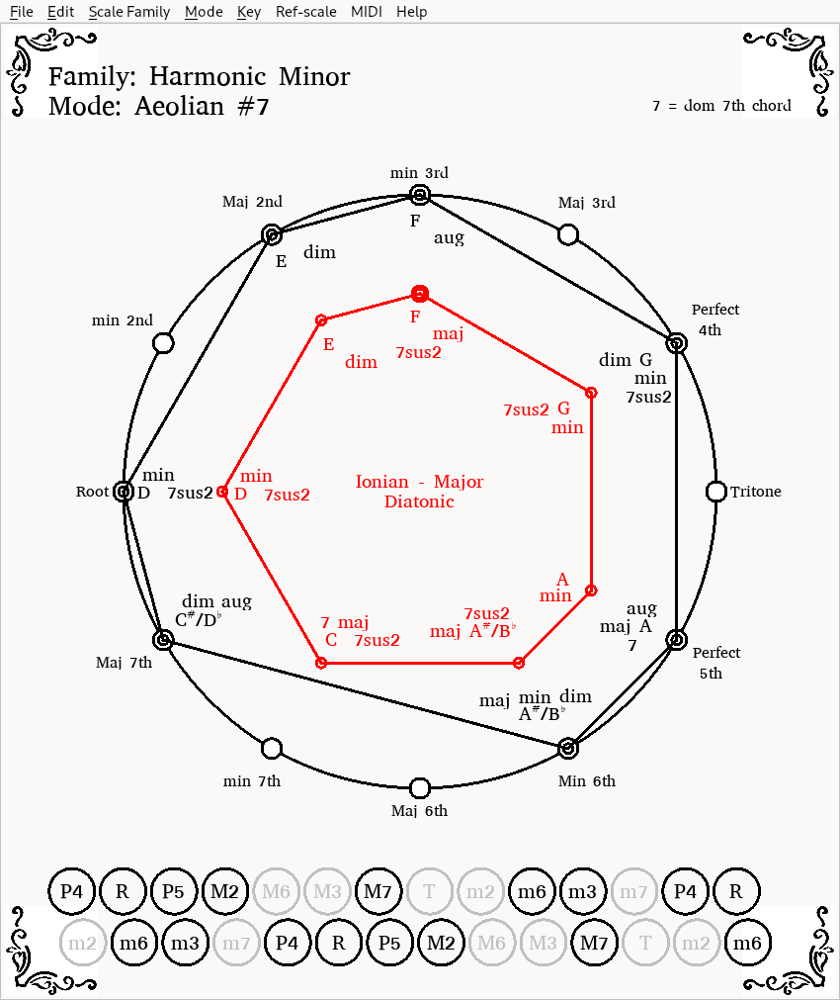

# Scale Smithy

A graphical tool for analysis of musical scales.

## Features
<li>Work and display scales on a chromatic circle</li>
<li>Save and load scale families</li>
<li>Enter notes and find the scale Family, mode and key</li>
<li>Edit scale families, create new ones</li>
<li>Select the scale family, mode and key</li>
<li>Set a scale as a reference</li>
<li>Play scale in various patterns to midi
<li>Stredella Bass referennce with relative intervals</li>

## Overview
I wrote this program to help me compose music for the 
bayan (russian Accordion).  I've found it to be very helpful
to look at scales from a family-mode-key perspective on
a chromatic circle.  Chords that fit the notes of a particular 
scale are printed next to each scale degree.  This can be useful
for composing chord progressions. You can control
how many chords, chord symbology and the position of the
scale root via Edit->preferences.  There's a *find the scale* feature
which analizes a series of notes and returns the matching scale 
(if any). Any scale can be set as a reference which is useful
in modal, scale family and/or key changes in a composition.  
Scales can be played via midi output to any instrument including
FluidSynth in one of a few patterns.

## Installation
requirements.txt lists the required libraries.  Primarily PyQt6
and mido.

